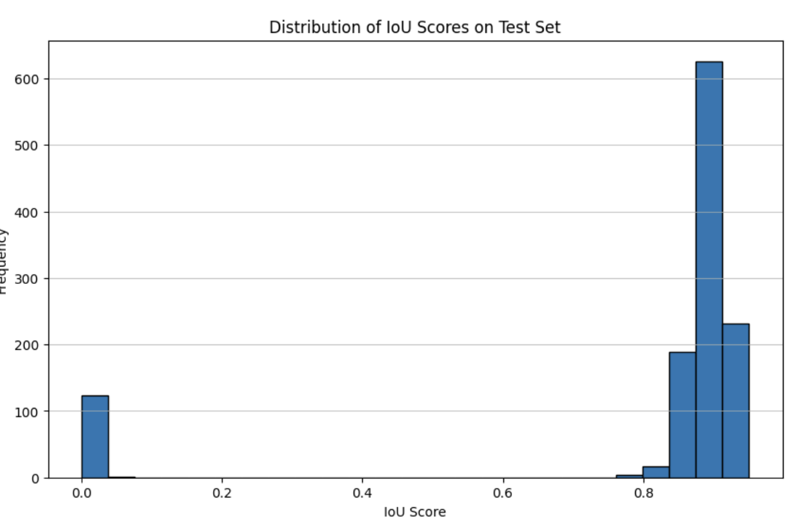
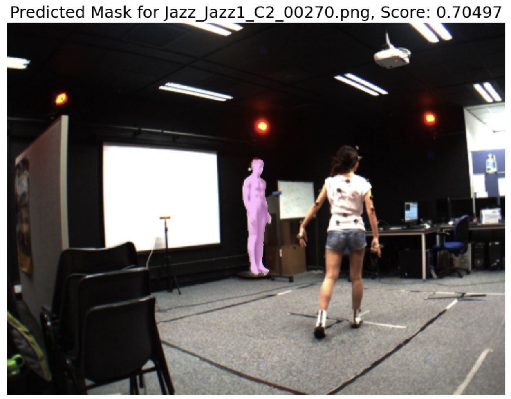
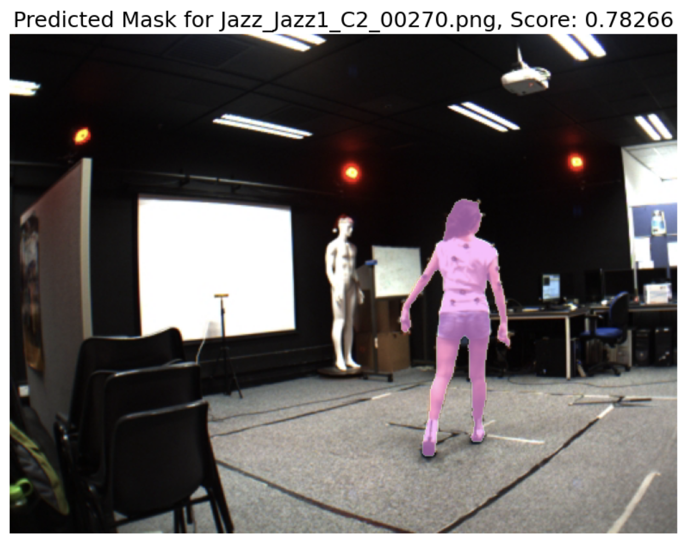
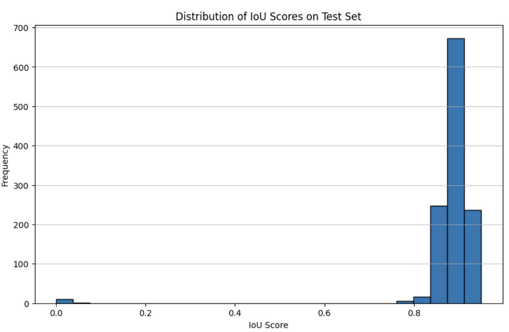

TODO:
- Add Deep Learning Section to Intro
- Add Note book
- Change Notebook URL
- Add Images
- Add Code

# Who would win? A State Of The Art Foundation Model or a Neural Net?

### Comparing the performance of Grounded Dino + SAM2 vs Traditional Deep Neural Networks

We often hear about the magnificient performance of Foundation Models and how they are going to revolutionize the world of AI. However, as a Machine Learning Engineer years of experience in the field, I'd say that one of the first lessons we learn is that sometimes a simple approach can perform just as good, or even better, than a shiny new model.

#### Objective:

In this article we will discuss the usage of Foundation Models for the task of image segmentation and compare them to a more traditional approach of fine tunning using deep learning.

#### Introduction:

**What is Image Segmentation?**
To put it simply image segmentation is a task where we identify an object in an image and then we trace the boundary around an object. If you use stickers on an [iPhone](https://support.apple.com/guide/iphone/make-stickers-from-your-photos-iph9b4106303/ios) or on WhatsApp then you are already familar with the task of Image Segementation! 

**The State of The Art**

The rise of the [transformer](https://arxiv.org/pdf/1706.03762) architecture has ushered in a drastic change in the machine learning space. One of the trends that we have been observing is the implementation of the transformer architecture into a plethora of domains. An example of one of this increased prevalence of the transformer architecture is the [Segment Anything Model](https://arxiv.org/pdf/2304.02643) by Meta.

The newest version [SAM2](https://arxiv.org/pdf/2408.00714) has increased performance and capabilities, this is due to the fact that Meta and other similar companies are able to train these models with vast quantities of data, more than what an individual would be able to do on their own computer. 

However, one of the shortcomings of this model is that it does not have the capability to receive a text prompt to then segment those objects from the image or video. The reason for this is that the SAM models require a recommendation in the form of a point or a bounding box to be able to then make their segmentation inference.

If we are able to have a model that is able to take in arbitrary text and output a point or a bounding box of those objects in the image then we would be able to have a zero shot image segmentation model! Fortunately, this is exactly what the [GroundingDINO](https://arxiv.org/pdf/2303.05499) model does!

Those two ideas together researchers at IDEA-Research created [Grounded-SAM2](https://github.com/IDEA-Research/Grounded-SAM-2). While they came up with the idea, I found the implementation of GroundingDino + SAM2 by [Luca Medeiros](https://github.com/luca-medeiros/lang-segment-anything) to be more developer friendly which is the one that I will be using for this article.

# Code Walkthrough

[Here](https://github.com/DMH42/zero-shot-segmentation/blob/main/Implementing_Zero_Shot_Segmentation.ipynb) you can find the Notebook that we will be walking through in this post.

[](https://colab.research.google.com/github/DMH42/zero-shot-segmentation/blob/main/Implementing_Zero_Shot_Segmentation.ipynb)

For this article we will be using [this](https://www.kaggle.com/datasets/tapakah68/segmentation-full-body-mads-dataset) Kaggle Dataset

## Foundation Model Section

Why would we use a Foundation Models such as SAM? The are two very straight forward answers to this question:
1. The model is already pre-trained and capable of doing the task meaning that we can get past the hurdle of not having a lot of training data.
2. It is very easy to get started and be able to produce results.

#### Setting Up The Enviornment

[Be sure to get your Kaggle.json file from to authenticate](https://www.kaggle.com/docs/api) and save it to your working directory.
**Setting up the kaggle directory**

```
!pip install kaggle
!mkdir -p /root/.config/kaggle
!sudo cp kaggle.json ~/.config/kaggle/
!sudo chmod 600 ~/.config/kaggle/kaggle.json
```

**Downloading the dataset**

```
!kaggle datasets download -d tapakah68/segmentation-full-body-mads-dataset
!unzip segmentation-full-body-mads-dataset.zip
```

**Installing the lang-sam library**

```
!pip install -U git+https://github.com/luca-medeiros/lang-segment-anything.git
```

**Importing the libraries**

```python
from PIL import Image
from lang_sam import LangSAM
import numpy as np
import os
import matplotlib.pyplot as plt
import kaggle
import cv2
model = LangSAM()
text_prompt = "person."
```

**Defining the evaluation function**
The evaluation method that we are using is the [Intersection Over Union](https://huggingface.co/learn/computer-vision-course/en/unit6/basic-cv-tasks/segmentation#how-to-evaluate-a-segmentation-model). It is common to use this metric (the ratio between the intersection of the predicted and true mask) divided by the union of the two. The closer the result is to 1 then then the closer the two masks are to be the same.

What we are doing here is to convert the segmentation masks into boolean arrays in order to then be able to do logical operations on them (in this case, intersection and union). Then we compare the ratio between the intersection and the union.

```python
def  intersection_over_union_metric(predicted_mask, true_mask):
	predicted_mask = predicted_mask.astype(bool)
	true_mask = true_mask.astype(bool)
	intersection = np.logical_and(predicted_mask, true_mask).sum()
	union = np.logical_or(predicted_mask, true_mask).sum()
	if union == 0:
		return  0.0
	iou = intersection / union
	return iou
```

**Picking Function**
We define this small function to find the index of the best mask from the model output.
This function will be relevant later on in the tutorial.

```python
def pick_best(masks, masks_scores, scores)
	max_index = 0
	for i, predicted_mask in  enumerate(masks):
		# find the mask that has the highest score
		if masks_scores[max_index] < masks_scores[i]:
				max_index = i
	return max_index
```

**Processing Function**
The following function is used to load the image, obtain the inference results from the model, and use the _pick_best_ function to pick the best mask result and return it.

```python
def evaluate_image(image_file, image_path, mask_path):
			#Load the image
			image_pil = Image.open(image_path).convert("RGB")
			image_np = np.array(image_pil)
			# Load the ground truth mask
			true_mask_pil = Image.open(mask_path).convert("L")
			# Convert to boolean mask
			true_mask_np = np.array(true_mask_pil) > 0
			# Predict the mask using LangSAM
			result = model.predict([image_pil],  [text_prompt])
			scores = result[0]['scores']
			boxes = result[0]['boxes']
			masks = result[0]['masks']
			masks_scores = result[0]['mask_scores']
			# the model could output no masks
			if  len(masks) == 0:
				print(f"No Prediction found for {image_file}")
				return {'image': image_file,  'iou': np.nan}
			if masks is  not  None  and  not(isinstance(masks,  list)):
				if masks_scores.ndim == 0:
					masks_scores = [masks_scores.item()]
				if scores.ndim == 0:
					scores = [scores.item()]
				max_index = pick_best(masks, masks_scores, scores)
				predicted_mask_np = masks[max_index]
				result_iou = evaluation_function(predicted_mask_np, true_mask_np)
				return {'image': image_file,  'iou': result_iou}
```

**Defining the evaluation function**
This function is the evaluation loop that we'll use to evaluate the results of the model, we load the files, use the evaluation function we defined previously, and return the aggregated results.

```python
def  evaluate_model_on_test_set(test_images_dir='./test_images',
test_masks_dir='./test_masks',
text_prompt="person.",
evaluation_function=intersection_over_union_metric, debug=True
):
	iou_results = []
	# Ensure the directories exist
	if  not os.path.exists(test_images_dir):
		print(f"Test images directory not found: {test_images_dir}")
	elif  not os.path.exists(test_masks_dir):
		print(f"Test masks directory not found: {test_masks_dir}")
	else:
		image_files = [f for f in os.listdir(test_images_dir)  if f.endswith(('.png',  '.jpg',  '.jpeg'))]
	for image_file in image_files:
		image_path = os.path.join(test_images_dir, image_file)
		mask_path = os.path.join(test_masks_dir, image_file)
		if  not os.path.exists(mask_path):
			print(f"Ground truth mask not found for {image_file}")
			continue
		try:
			iou_results.append(evaluate_image(image_file, image_path, mask_path))
		except Exception as e:
			# if there was an error processing then we insert a NaN value
			if debug: print(f"Error processing {image_file}: {e}")
			iou_results.append({'image': image_file,  'iou': np.nan})
	# Print average IoU
	if debug and len(iou_results) > 0:
		average_iou = np.nanmean([res['iou']  for res in iou_results])
		print(f"\nAverage IoU across test set: {average_iou:.4f}")
	elif debug:
		print("No images were processed.")
	return iou_results
```

**Run the evaluation loop**
We then run the evaluation loop on the dataset.

```python
test_images_dir = './segmentation_full_body_mads_dataset_1192_img/segmentation_full_body_mads_dataset_1192_img/images'
test_masks_dir = './segmentation_full_body_mads_dataset_1192_img/segmentation_full_body_mads_dataset_1192_img/masks'
text_prompt = "person."
iou_results = evaluate_model_on_test_set(test_images_dir, test_masks_dir, text_prompt, modified_IOU)
```

**Results**

We get an average score of **0.8001** when we run the evaluation loop, which is a decent performance for a task that the model was not fine tunned for this task as under the hood two models are run sequentially to obtain the predicted mask.

**Making a histogram**
Often times when we evaluate models it is useful to see the distribution of our results. A helpful tool for the task is the usage of a histogram.

```python
def make_histogram(iou_results)
	iou_scores = [res['iou'] for res in iou_results if not np.isnan(res['iou'])]
	if len(iou_scores) >= 0:
		plt.figure(figsize=(10, 6))
		plt.hist(iou_scores, bins=25, edgecolor='black')
		plt.title('Distribution of IoU Scores on Test Set')
		plt.xlabel('IoU Score')
		plt.ylabel('Frequency')
		plt.grid(axis='y', alpha=0.75)
		plt.show()
	else:
		print("No valid IoU scores available to plot the histogram.")
```



As we can see, we have a lot of instances with 0 as their score. The distribution is not continuous and they cluster at 0, this is often indicative of some sort of recurring problem which means that we should dig deeper.

**Exploring the lowest performing images**
We can use this code snippet in order to obtain the worst performing images and see if there is something we can do to improve the performance.

```python
# Sort the iou_results by IoU in ascending order
sorted_iou_results = sorted(iou_results, key=lambda x: x['iou'])

# Get the lowest values and their corresponding image names
lowest_iou_results = sorted_iou_results[:20] # Get the bottom 10

print("Lowest IoU values and corresponding image names:")
for result in lowest_iou_results:
  print(f"Image: {result['image']}, IoU: {result['iou']:.4f}")
```

Unfortunately as it is often the case when working with ML models, we got some false positives. As such, we should figure out what we can do in order to improve the performance.

**Show the masks**
To dig deeper we can go ahead and explore the failed results. We define these functions to use them as helpers in order to show the base image, and the corresponding predicted masks.

```python
def show_mask(mask, ax, random_color=False, borders = True):
    if random_color:
        color = np.concatenate([np.random.random(3), np.array([0.6])], axis=0)
    else:
        color = np.array([255/255, 144/255, 255/255, 0.6])
    h, w = mask.shape[-2:]
    mask = mask.astype(np.uint8)
    mask_image =  mask.reshape(h, w, 1) * color.reshape(1, 1, -1)
    if borders:
        import cv2
        contours, _ = cv2.findContours(mask,cv2.RETR_EXTERNAL, cv2.CHAIN_APPROX_NONE)
        # Try to smooth contours
        contours = [cv2.approxPolyDP(contour, epsilon=0.01, closed=True) for contour in contours]
        mask_image = cv2.drawContours(mask_image, contours, -1, (1, 1, 1, 0.5), thickness=1)
    ax.imshow(mask_image)

def show_masks(image, masks, scores, point_coords=None, box_coords=None, input_labels=None, borders=True):
    for i, (mask, score) in enumerate(zip(masks, scores)):
        plt.figure(figsize=(10, 10))
        plt.imshow(image)
        show_mask(mask, plt.gca(), borders=borders)
        if point_coords is not None:
            assert input_labels is not None
            show_points(point_coords, input_labels, plt.gca())
        if box_coords is not None:
            # boxes
            show_box(box_coords, plt.gca())
        if len(scores) > 1:
            plt.title(f"Mask {i+1}, Score: {score:.5f}", fontsize=18)
        plt.axis('off')
        plt.show()
```

**Lets pick one of the lower performing images**

```python
image_file = "Jazz_Jazz2_C1_00630.png"
image_path = os.path.join(test_images_dir, image_file)
mask_file = image_file
mask_path = os.path.join(test_masks_dir, mask_file)
image_pil = Image.open(image_path).convert("RGB")
image_np = np.array(image_pil)
true_mask_pil = Image.open(mask_path).convert("L")
true_mask_np = np.array(true_mask_pil) > 0
result = model.predict([image_pil], [text_prompt])
scores = result[0]['scores']
boxes = result[0]['boxes']
masks = result[0]['masks']
mask_scores = result[0]['mask_scores']
show_masks(image_pil, masks, scores)
```

In this case, the model correctly identified an object that is shaped like a person but is not a real person.



**Updating The Picking Function**
We can use both the information from the SAM2 model and the GroundedDino model in order to be able to get a more accurate selection. This modified function will make it so that we only pick the object that both of the scores of the models agree. So instead of just picking the best result from the SAM2 Model (the mask_scores) we use also the best score from the Grounding DINO model.

```python
def pick_best(masks, masks_scores, scores)
	max_index = 0
	for i, predicted_mask in  enumerate(masks):
		# find the mask that has the highest score
		if masks_scores[max_index] < masks_scores[i]:
			if scores[max_index] < scores[i]:
				max_index = i
	return max_index
```

This function now allows us to get this accurate mask:



**Results**


By implementing this small change on the picking function we are able to boost the performance to an average of **0.8830** which is better than the initial performance.

As you've seen it was very straight forward to set up the inference for the model and to start generating results. We needed to do a little bit of debugging in order to boost the performance but it didn't require a lot more effort. This is an example of how foundation models can help increase the productivity of engineering teams by allowing us to ship quickly.


## Traditional Deep Learning
Due to the fact that we have a relatiely large dataset (1k+ images) then it is senisble to try fine tunning a neural network to be able to comapre the results.

In order to train a neural netw

## Conclusion

Through this walkthrough you now have now seen how to do Zero Shot Image Segmentation through the usage of the SAM2 model and the GroundedDino model. Not only that but we also explored the potential ways to explore the data and then be able to increase the performance by figuring what are the problems that your implementation has along the way. This is because in the field of ML it is not always the case that you will get the best results form the beginning and as you need to iteratively improve the performance as you find ways of fixing the problems your implementation faces.

Thank you!
